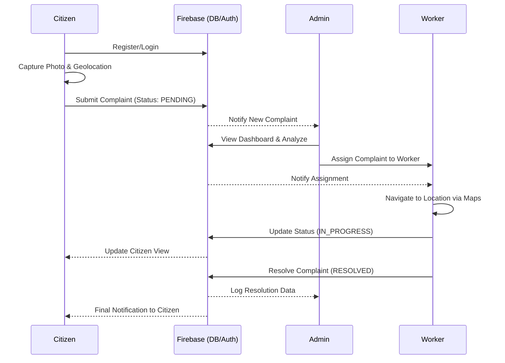

# 🚰 Sewage Management System - Project Documentation

## 1. Introduction
The **Sewage Management System** is a mobile-first, real-time solution designed to bridge the gap between citizens and municipal authorities in urban sanitation management. Efficient sewage disposal and maintenance are critical for public health and city infrastructure. However, traditional reporting methods are often slow, lack transparency, and keep citizens in the dark about the status of their complaints.

This project addresses these challenges by providing a digital platform where:
- **Citizens** can report issues instantly with visual proof and precise geolocation.
- **Workers** receive optimized assignments and can update their progress in real-time.
- **Administrators** gain a bird's-eye view of the city's sanitation health through interactive maps and analytics.

By leveraging modern technologies like **Kotlin**, **MVVM Architecture**, and **Firebase**, this system ensures data integrity, real-time synchronization, and a premium user experience.

---

## 2. Functional Requirements

### 👤 Citizen (User)
- **Account Management**: Secure registration and login using Firebase Authentication.
- **Submit Complaint**: 
  - Select category (Blockage, Overflow, Leakage, etc.).
  - Add descriptive text and attach photos for visual assessment.
  - Pin the exact location automatically using GPS or manually via Google Maps.
- **Track Complaint**: Real-time view of complaint status (Pending, Assigned, In Progress, Resolved).
- **History**: Access to a list of all previously submitted complaints and their outcomes.

### 👷 Worker
- **Assignment View**: List of complaints specifically assigned to them by the Admin.
- **Navigation**: Integrated Google Maps view to see the exact location of the issue.
- **Status Updates**: Ability to mark tasks as "In Progress" or "Resolved" once the work is completed.
- **Notifications**: Instant alerts when a new complaint is assigned or updated.

### 🧑‍💼 Admin / Authority
- **Global Dashboard**: A comprehensive overview of all pending and active complaints across the city.
- **Worker Management**: Create and manage worker accounts (Workers cannot self-register).
- **Task Assignment**: Delegate specific complaints to available workers based on location or priority.
- **Interactive Heatmap**: Visual map showing "hotspots" of sewage issues to help in long-term infrastructure planning.
- **Analytics**: Data visualization of resolution times, frequency of issues by area, and worker performance.

---

## 3. Flow Diagram (Working of Project)

The following diagram illustrates the lifecycle of a complaint and the interaction between different roles within the system.

---

## 4. How to Scale or Enhance the Project

To evolve this project into a world-class urban management tool, several enhancements and scaling strategies can be implemented:

### 🤖 AI-Powered Diagnostics (Enhancement)
Integrating **Computer Vision** models (like TensorFlow Lite) directly into the app. When a citizen uploads a photo, the AI can:
- Automatically categorize the issue.
- Estimate the severity level (Minor vs. Critical).
- Filter out "spam" or irrelevant photos, reducing the burden on human administrators.

### 🔌 IoT Integration (Scalability)
Instead of waiting for citizens to report leaks, **Smart Sensors** can be installed at critical points in the sewage network. These sensors would:
- Monitor pressure and flow levels.
- Automatically trigger a "System-Generated Complaint" in the Admin dashboard if a blockage or overflow is detected.
- Enable **Predictive Maintenance**, fixing issues before they symptoms become visible to the public.

### 🏢 Microservices & Multi-Tenancy (Scalability)
To scale the app from a single city to an entire country:
- **Microservices**: Decompose the backend into independent services (Auth, Logging, Map-Engine) for higher availability.
- **Multi-Tenancy**: Allow different municipal corporations to use the same platform while keeping their data strictly isolated.

### 🌐 Cross-Platform Expansion (Enhancement)
While the current version is native Android, expanding to **Web** (for Admin dashboards) and **iOS** (using Kotlin Multiplatform) would ensure that the system is accessible to every stakeholder, regardless of their device.

---

*This document serves as the official blueprint for the Sewage Management System v1.0.*
