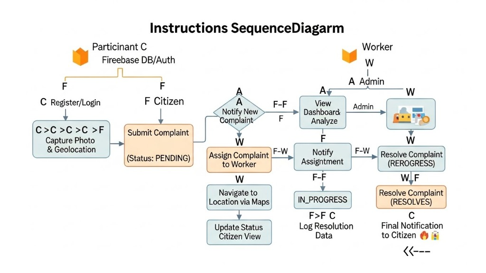

# 🚰 Sewage Management System - Project Documentation

## 1. Introduction
The **Sewage Management System** is a mobile-first, real-time solution designed to bridge the gap between citizens and municipal authorities in urban sanitation management. Efficient sewage disposal and maintenance are critical for public health and city infrastructure. However, traditional reporting methods are often slow, lack transparency, and keep citizens in the dark about the status of their complaints.

This project addresses these challenges by providing a digital platform where:
- **Citizens** can report issues instantly with visual proof and precise geolocation.
- **Workers** receive optimized assignments and can update their progress in real-time.
- **Administrators** gain a bird's-eye view of the city's sanitation health through interactive maps and analytics.

By leveraging modern technologies like **Kotlin**, **MVVM Architecture**, and **Firebase**, this system ensures data integrity, real-time synchronization, and a premium user experience.

### Problem Statement
In many urban areas, sewage overflows and blockages are reported via phone calls or physical visits to government offices. This results in:
- **Delayed Response**: Requests are often lost in paperwork.
- **Lack of Accountability**: No way to verify if a worker actually visited the site.
- **Information Asymmetry**: Citizens have no visibility into the resolution process.

### The Solution: "Clean City" App
Our app digitizes the entire lifecycle of a sanitation complaint, ensuring every report is tracked from submission to resolution.

---

## 2. Functional Requirements

### 👤 Citizen (User)
The citizen interface is designed for simplicity and speed, ensuring that reports can be filed in under 60 seconds.
- **Secure Authentication**: Multi-factor authentication support via Firebase (Email/OTP).
- **Interactive Complaint Submission**:
  - **Category Selection**: Dropdown for issues like Leakage, Overflow, Blockage, or Manhole Cover Missing.
  - **Multimedia Evidence**: High-resolution photo upload directly from the camera or gallery.
  - **Geolocation Precision**: Automatic retrieval of latitude/longitude using Play Services Location API.
- **Real-Time Tracking**: A persistent "My Complaints" tab with color-coded status badges (Red for Pending, Yellow for In Progress, Green for Resolved).
- **Communication Channel**: Notifications triggered whenever an admin assigns a worker or a worker arrives at the site.

### 👷 Worker
The worker module is built for field efficiency, prioritizing navigation and quick status updates.
- **Dynamic Task Queue**: A specialized list showing only the tasks assigned to the specific logged-in worker.
- **One-Tap Navigation**: Integration with Google Maps API to provide turn-by-turn directions to the complaint site.
- **Field Reporting**:
  - **Site Verification**: Workers can upload "Before" and "After" photos to prove work quality.
  - **Status Management**: Simple toggle to switch status from 'Assigned' to 'In Progress' and finally 'Resolved'.
- **Offline Capability**: Partial support for caching task details when working in areas with poor cellular reception.

### 🧑‍💼 Admin / Authority
The central command center for city sanitation management.
- **Comprehensive Oversight**: A real-time stream of all incoming complaints across the metropolitan area.
- **Automated Routing & Manual Override**: 
  - Ability to filter complaints by proximity to available workers.
  - Drag-and-drop assignment of tasks.
- **Data-Driven Insights**:
  - **Hotspot Detection**: Heatmaps identifying recurring problem areas that may need systemic pipeline upgrades.
  - **Performance Metrics**: Tracking resolution times (Average Time to Resolve) by worker or by area.
- **Security & Governance**: Full audit logs of who assigned which task and when it was completed.

---

## 3. Technical Architecture

### Core Technologies
- **Frontend**: Native Android development using **Kotlin** for peak performance and hardware integration.
- **UI Framework**: Material Design 3 (M3) components for a modern, accessible interface.
- **Architecture**: **MVVM (Model-View-ViewModel)** ensures that the business logic is decoupled from the UI, making the app easier to maintain and test.
- **Data Binding**: ViewBinding used to eliminate null-pointer exceptions during UI interaction.

### Backend Infrastructure (Firebase)
- **Firestore**: A NoSQL document database used for real-time data sync. This allows the Admin dashboard to update the moment a worker clicks "Resolved".
- **Storage**: Highly scalable cloud storage for complaint images.
- **Authentication**: Industry-standard security for user data protection.
- **Cloud Functions**: Server-side logic to handle administrative tasks like secure worker account creation.

---

## 3. Flow Diagram (Working of Project)

The following diagram illustrates the lifecycle of a complaint and the interaction between different roles within the system.

---

## 4. How to Scale or Enhance the Project

To evolve this project into a world-class urban management tool, several enhancements and scaling strategies can be implemented:

### 🤖 AI-Powered Diagnostics (Short Term)
Integrating **Computer Vision** models (like TensorFlow Lite) directly into the app. When a citizen uploads a photo, the AI can:
- **Auto-Categorization**: Instantly identify the type of issue (e.g., distinguishing between a simple leak and a dangerous open manhole).
- **Severity Scoring**: Estimate the volume of overflow to prioritize critical repairs first.
- **Fraud Detection**: Prevent duplicate reports or unrelated images from entering the system.

### 🔌 IoT Integration (Medium Term)
Transitioning from reactive reporting to proactive maintenance using **Internet of Things (IoT)** sensors:
- **Flow Sensors**: Installed in main conduits to monitor for unusual pressure drops or spikes.
- **Automated Tickets**: If a sensor detects a blockage, it automatically creates a high-priority "System Complaint" before citizens even notice the problem.
- **Predictive Analytics**: Using historical data to predict which pipes are likely to fail during heavy monsoon seasons.

### 🏢 Microservices & Multi-Tenancy (Long Term)
To scale the app from a single city to a national platform:
- **Multi-Tenant Architecture**: A single cloud instance serving multiple municipal districts, each with their own isolated data and admin controls.
- **Scaling API Gateway**: Using an API Gateway to handle millions of simultaneous connections during peak periods (e.g., after a major storm).

### 💳 Public Awareness & Gamification
- **Leaderboards**: Recognizing the most "Active Citizens" who help keep their neighborhoods clean.
- **Educational Content**: In-app tips on proper waste disposal to prevent clogs.

---

*This document serves as the official blueprint for the Sewage Management System v1.0.*
